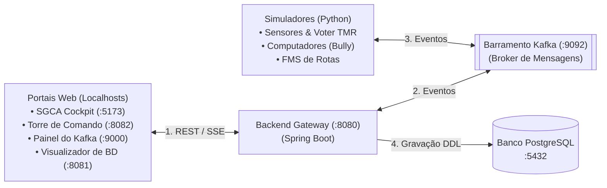
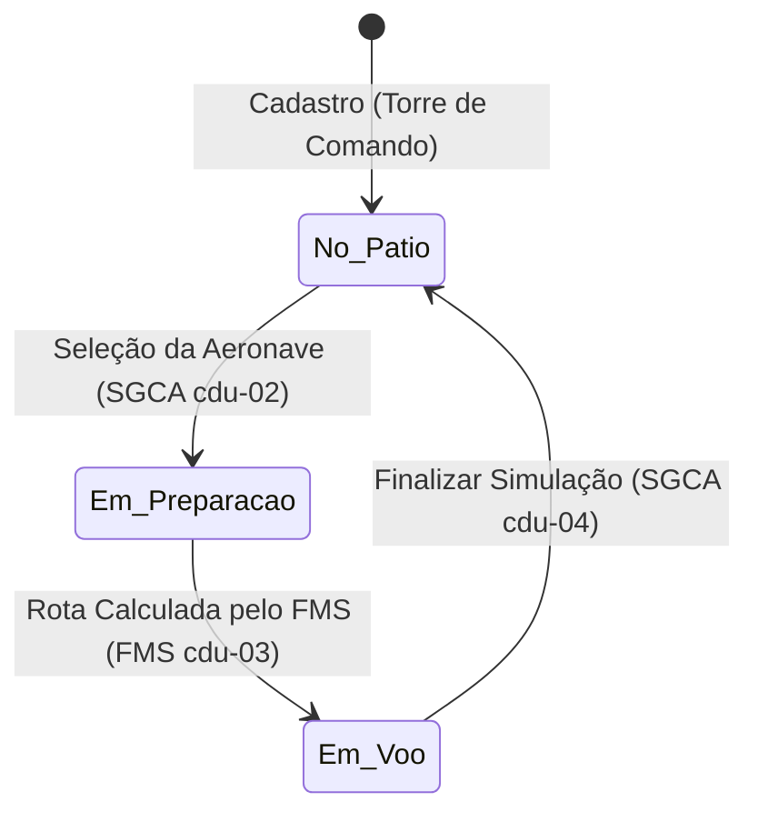

# Fluxo de Integração dos Novos Sistemas (Visão Geral)

Este documento descreve o fluxo completo de integração, as transições de estado e o sincronismo temporal entre as aplicações e módulos do ecossistema distribuído de aviônica.

---

## 1. Arquitetura Geral Simplificada

O ecossistema é integrado por meio de três tipos de canais de dados (REST, Mensagens e Eventos SSE), conectando as interfaces, o core de processamento e os simuladores:

### Canais de Integração Utilizados:
*   **1. HTTP REST / SSE (Síncrono e Tempo Real):** As interfaces utilizam chamadas REST para comandos e configurações. O SGCA Cockpit mantém uma escuta de **Server-Sent Events (SSE)** com o Backend para receber a telemetria consolidada instantaneamente.
*   **2. Mensageria Assíncrona (Kafka):** Desacopla o Backend dos simuladores Python. O Backend apenas publica requisições e consome telemetrias consolidadas, sem precisar conhecer o estado interno dos sensores.
*   **3. Persistência de Dados (PostgreSQL):** O banco de dados é acessado exclusivamente pelo Backend Gateway para persistir rotas, telemetrias e logs de auditoria organizados cronologicamente.

---

## 2. Ciclo de Vida da Aeronave (Estados)

Para evitar inconsistências, a aeronave passa por 4 estados definidos no banco de dados:

*   **No Pátio (On Ground):** A aeronave está cadastrada e disponível para voo, mas inativa.
*   **Em Preparação (Preparing):** A aeronave foi selecionada no SGCA, aguardando definição de origem, destino e cálculo da rota.
*   **Em Voo (In Flight):** O FMS concluiu o cálculo da rota e os sensores estão publicando telemetrias ativamente para a aeronave.

---

## 3. Sequência de Integração e Sincronismo (Passo a Passo)

### Fase 1: Cadastro da Aeronave
1. O **Usuário** envia o formulário de cadastro na **Torre de Comando** com o prefixo da aeronave (ex: `PR-AAA`).
2. A **Torre de Comando** realiza um `POST /api/aircraft` para o **Backend Gateway**.
3. O **Backend Gateway** grava a aeronave no banco **PostgreSQL** com o status inicial `No Pátio`.
4. O **Backend Gateway** publica um evento de criação no **Kafka** (`avionica.aircraft.created`).
5. A **Torre de Comando** recebe a confirmação e redireciona o usuário para a lista de aeronaves ativas.

### Fase 2: Seleção e Preparação da Simulação
6. O **Usuário** localiza e seleciona a aeronave `PR-AAA` na tela de simulação do **SGCA Cockpit**.
7. O **SGCA** envia a confirmação de seleção (`POST /api/aircraft/select`) ao **Backend Gateway**.
8. O **Backend Gateway** atualiza o status da aeronave no **PostgreSQL** para `Em Preparação`.
9. O **SGCA** redireciona o usuário para a tela de planejamento de rota (`/simulacao/rota`).

### Fase 3: Planejamento e Cálculo Assíncrono de Rota
10. O **Usuário** define os códigos ICAO de origem e destino no **SGCA** e clica em "Simular".
11. O **SGCA** dispara a chamada (`POST /api/simulation/start`) e redireciona o usuário imediatamente para o Dashboard.
12. A tela do Dashboard é renderizada exibindo o estado temporário de carregamento **"Aguardando Cálculo de Rota..."**.
13. O **Backend Gateway** grava a solicitação como `PENDING` no banco e publica o evento `avionica.route.requested` no **Kafka**.
14. O módulo **FMS (Python)** consome a solicitação do Kafka, efetua o cálculo da trajetória (API ou Dijkstra local Fallback) e publica a rota calculada no tópico `avionica.route.calculated`.
15. O **Backend Gateway** consome a rota calculada, atualiza o banco e muda o status da aeronave para `Em Voo`.
16. O **Backend Gateway** envia a rota ao **SGCA** via Server-Sent Events (SSE), que atualiza a tela e inicia os instrumentos.

### Fase 4: Simulação Ativa e Telemetria (Loop de Voo)
17. Os **Sensores** detectam a rota calculada no Kafka e iniciam a simulação de voo.
18. Em loop contínuo (a cada 1 segundo):
    * Os **Sensores** realizam sincronização de tempo com o **Backend** usando o **Algoritmo de Cristian** (para compensar latência de rede).
    * Os **Sensores** publicam dados de velocidade, altitude, freios e motores (A, B, C) no **Kafka**.
    * O **Voter TMR** consome os motores A, B e C, realiza a votação por maioria (eliminando nós com falhas) e publica o motor consolidado.
    * O **Backend Gateway** consome a telemetria consolidada, salva no banco ordenando por **Lamport Timestamps** e transmite os dados para o **SGCA** por SSE.
    * O **SGCA** atualiza os ponteiros analógicos, fitas e CAS na tela do cockpit.

### Fase 5: Encerramento do Voo
19. O **Usuário** clica em "Encerrar Simulação" no painel do **SGCA**.
20. O **SGCA** envia a requisição de parada (`POST /api/simulation/stop`) para o **Backend Gateway**.
21. O **Backend Gateway** atualiza a aeronave para `No Pátio` no banco e publica `avionica.simulation.ended` no **Kafka**.
22. Os **Sensores** consomem o encerramento do Kafka e encerram a geração de telemetria.
23. O **SGCA** redireciona o usuário de volta para a tela inicial de simulação.

---

## 4. Detalhes das Integrações e Segurança de Fluxo

> [!NOTE]
> **Resiliência do Dashboard:** O redirecionamento imediato para a URL `/simulacao/dashboard/...` evita que falhas de latência ou lentidão na API externa do FMS travem a experiência do usuário. O estado `PENDING` exibe uma tela limpa de carregamento, ativando os medidores apenas quando o canal SSE transmite a confirmação de que a aeronave está no estado `Em Voo`.

> [!IMPORTANT]
> **Economia de Recursos do Barramento:** A publicação de telemetria pelos sensores Python não roda indefinidamente. Eles são escutadores passivos do Kafka. Apenas iniciam o processamento ao ver `avionica.route.calculated` e interrompem imediatamente todas as threads ao ler `avionica.simulation.ended`.

---

## 5. Resumo dos Endereços Locais (Portas)

Ao rodar a aplicação reestruturada por meio do Docker Compose, os seguintes endereços ficam disponíveis para acesso:

| Aplicação | URL / Porta | Função |
|---|---|---|
| **SGCA (Cockpit Simulator)** | `http://localhost:5173` | Interface principal de pilotagem e simulação |
| **Backend Gateway Central** | `http://localhost:8080` | Endpoint de APIs REST e conexões SSE |
| **Painel do Kafka** | `http://localhost:9000` | Monitoramento visual das mensagens em tempo real |
| **Visualizador de BD** | `http://localhost:8081` | Acesso gráfico às tabelas e registros do PostgreSQL |
| **Torre de Comando** | `http://localhost:8082` | Cadastro e inicialização de aeronaves |
