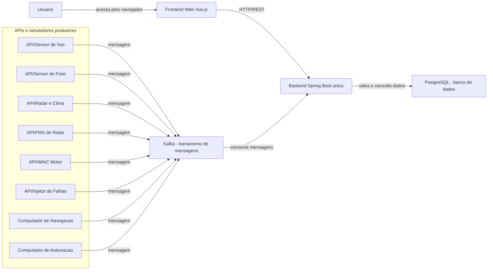

# Introducao e Fluxo do Sistema

## Ideia Principal

O sistema e uma plataforma distribuida de monitoramento avionico.

A ideia central e:

1. As APIs e simuladores geram dados dos sensores da aeronave.
2. Esses dados sao publicados no Kafka.
3. O backend Spring Boot, que e unico, consome os dados do Kafka.
4. O backend salva os dados no PostgreSQL.
5. O frontend web em Vue acessa o backend por REST.

## O Sistema E Orientado a Mensagens?

Sim.

Ele e orientado a mensagens porque os dados nao vao direto dos sensores para o backend por chamada HTTP. Os sensores e APIs publicam mensagens em topicos Kafka. Depois, o backend consome essas mensagens.

Isso cria desacoplamento:

- quem gera os dados nao precisa saber quem vai consumir;
- o backend pode processar mensagens de forma assincrona;
- outros consumidores podem ser adicionados depois;
- o Kafka funciona como barramento de mensagens do sistema.

## O Que Existe no Projeto

O projeto tera:

- APIs/simuladores produtores de dados;
- Kafka como barramento de mensagens;
- um unico backend Spring Boot;
- PostgreSQL como banco de dados;
- frontend web em Vue.js.

## O Que Conta Como Modulo

Conta como modulo:

- API/simulador rodando como processo separado;
- produtor Kafka desenvolvido pela equipe;
- consumidor Kafka desenvolvido pela equipe;
- backend Spring Boot unico;
- frontend Vue web.

Nao conta como modulo:

- Kafka;
- PostgreSQL;
- Docker;
- Docker Compose;
- `service`;
- `dto`;
- `model`;
- tela Vue separada;
- componente Vue separado.

## Diagrama do Sistema

## Explicacao do Diagrama

O backend nao esta dividido em varios backends. Existe apenas um backend Spring Boot.

Dentro desse backend podem existir classes, pacotes e camadas como:

- `controller`;
- `service`;
- `dto`;
- `model`;
- `repository`;
- `KafkaListener`.

Essas partes sao internas ao backend e nao contam como modulos separados.

O frontend tambem e um unico modulo Vue. As telas de dashboard, CDU, telemetria, historico e status sao partes internas desse frontend.

## Fluxo de Dados

1. Um sensor ou simulador gera uma leitura.
2. Essa leitura vira uma mensagem.
3. A mensagem e publicada no Kafka.
4. O backend Spring Boot consome a mensagem.
5. O backend valida e processa a informacao.
6. O backend salva a informacao no PostgreSQL.
7. O frontend Vue solicita os dados ao backend por REST.
8. O usuario visualiza os dados na interface web.

## Resumo

O sistema e distribuido porque possui varios processos independentes gerando e consumindo dados.

O sistema e orientado a mensagens porque a comunicacao principal entre sensores/APIs e backend acontece por Kafka.

O backend Spring Boot e unico. O frontend Vue tambem e unico. Kafka e PostgreSQL sao infraestrutura e nao entram na contagem de modulos.
